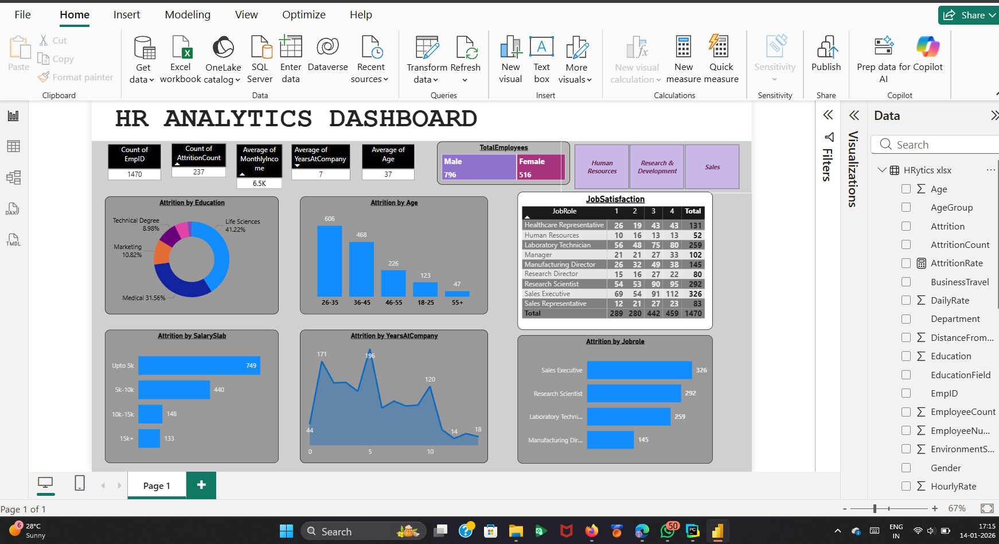
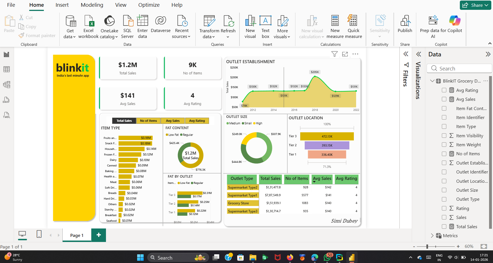
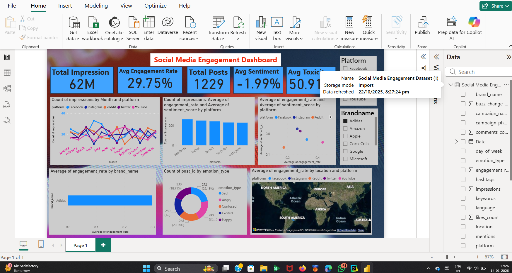

## 📊 Analytics Dashboards

This repository contains multiple interactive and analytical dashboards built for different real-world use cases.

---

## 📸 Dashboard Screenshots

### 🧑‍💼 HR Analytics Dashboard
This dashboard focuses on employee-related insights such as performance, attendance, attrition, and workforce trends to support HR decision-making.

---

### 🛒 Blinkit Sales & Operations Dashboard
This dashboard analyzes Blinkit data including sales performance, order trends, delivery insights, and operational efficiency.

---

### 📱 Social Media Engagement Dashboard
This dashboard visualizes social media metrics like likes, comments, shares, reach, and engagement trends across platforms.

---

## 🚀 Tools & Technologies
- Python / Power BI / Excel (as applicable)
- Data Visualization & Analytics
- Dashboard Design Principles

## 📌 Purpose
To demonstrate practical analytics dashboards for business, operations, and digital engagement analysis.
